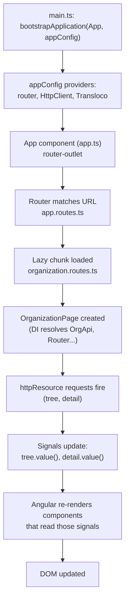

# 1. The mental model

## What Angular is

Angular is a full framework, not a library like React. "Full framework" means it ships
its own answers for the things React leaves to the ecosystem: routing
(`@angular/router`), HTTP (`@angular/common/http`), forms (`@angular/forms`),
dependency injection (`@angular/core`'s injector), and a compiler that type-checks your
templates against your component classes (`strictTemplates` in
`apps/web/tsconfig.json`). You install these as separate packages
(`apps/web/package.json`), but they are designed to fit together, and this project uses
all of them.

A component in Angular is a TypeScript class plus a template (HTML). The class holds
state and logic; the template renders it and wires up events. That much is like React.
The differences that matter most while you're learning:

- **State is signals, not a `useState` hook.** A signal is a container you read by
  calling it (`count()`) and write with `.set()`/`.update()`. See chapter 03.
- **The compiler understands your templates.** `t.hasError('required')` in a `.html`
  file is checked against the real type of `t`, at build time. A typo is a compile
  error, not a runtime blank.
- **Dependency injection is built in and structural**, not just a pattern you can
  choose to use. See chapter 04.
- **There's no virtual DOM.** Angular's compiler turns your template into instructions
  that update the real DOM directly; change detection decides *when* to run those
  instructions (see "zoneless", below), not *what* the DOM should look like from
  scratch.

## From `main.ts` to pixels

Here is what happens when a browser loads HRForce Next and the user is on `/organization`:

```
main.ts
  bootstrapApplication(App, appConfig)
       │
       ├─ appConfig.providers runs first:            (app.config.ts)
       │    - provideRouter(routes, withComponentInputBinding())
       │    - provideHttpClient(withFetch(), withXsrfConfiguration(...), withInterceptors([...]))
       │    - provideTransloco({...})
       │    - provideAppInitializer(() => inject(LanguageService).init())
       │
       ▼
  App component created (app.ts) — the root <app-root>
       │  its template has <router-outlet/> (app.html)
       ▼
  Router matches the URL "/organization" against routes (app.routes.ts)
       │  path 'organization' → loadChildren() → fetch a separate JS chunk
       ▼
  organization.routes.ts loaded → ORGANIZATION_ROUTES → matches '' → OrganizationPage
       │
       ▼
  OrganizationPage instantiated
       │  - DI creates it: inject(OrgApi), inject(Router), inject(ActivatedRoute)
       │  - withComponentInputBinding() copies ?asOf= into its `asOf` signal input
       │  - its constructor/field initializers create httpResources (tree, detail)
       │    which schedule HTTP requests as effects
       ▼
  Template renders: <app-org-tree>, <app-unit-detail>, forms — a tree of child components
       │
       ▼
  Later: a signal changes (tree.value() arrives, user clicks a node, types a date)
       │  Angular re-renders only the components whose template read that signal
       ▼
  Updated DOM — no full re-render, no zone.js patch of setTimeout/addEventListener
```



Two files anchor this: `apps/web/src/main.ts` and `apps/web/src/app/app.config.ts`.
`app.config.ts`'s own comments walk through each provider; this diagram is the "why in
this order" view.

## Zoneless: why signals matter

Older Angular apps depend on `zone.js`, a library that monkey-patches
`setTimeout`, `addEventListener`, promises, etc., so that *any* async callback
triggers "please re-check the whole app for changes." It works, but it is a blunt
instrument: everything gets re-checked, whether it changed or not.

HRForce Next has no `zone.js` (there is no `zone.js` import anywhere, and
`provideBrowserGlobalErrorListeners()` in `app.config.ts` is the zoneless-era
replacement for zone's global error handling). Without zone.js, Angular has no generic
signal that "something happened, please check." Instead, it relies on **signals**:
when a component's template reads `tree.value()` or `mode()`, Angular records that
dependency, and when the signal changes, exactly that component's view is scheduled for
re-render — nothing else.

This is why the org-unit picker sets `this.query.set(text)` instead of just mutating a
plain field, and why `organization.page.ts` derives `effectiveAsOf`, `root`, `names` and
`actions` with `computed()` rather than plain getters: a getter re-runs (and a plain
field never notifies anyone) — a signal is trackable, a `computed()` is trackable and
cached. Chapter 03 covers this in depth.

## Angular vs React vs NestJS: same concept, three names

`apps/api` (NestJS) intentionally mirrors Angular's building blocks — decorators,
modules, dependency injection — because the same mental model was meant to carry over.
This table lines the three up. It's a map to reduce "wait, is this the same idea?"
moments, not a claim that the tools are interchangeable.

| Concept | Angular (`apps/web`) | React | NestJS (`apps/api`) |
|---|---|---|---|
| Building block | `@Component` class + template | function component | `@Controller` / `@Injectable` class |
| Local state | `signal()` | `useState()` | n/a (request-scoped, not UI state) |
| Derived state | `computed()` | `useMemo()` | n/a |
| Side effects | `effect()` (rare; prefer `computed`) | `useEffect()` | n/a |
| Dependency wiring | `inject()` / constructor injection, an injector tree | import the module directly, or Context | constructor injection, a module graph |
| "Give me one shared instance" | `@Injectable({ providedIn: 'root' })` | a module-level singleton, or Context provider | `@Injectable()` + a provider in a `@Module` |
| Composing behavior | decorators (`@Component`, `@Injectable`) read by the compiler | plain functions/hooks | decorators (`@Controller`, `@Injectable`, `@Module`) read by reflection |
| Routing | `@angular/router`, a `Routes` array | react-router, file-based routers, etc. | `@Controller('path')` + method decorators (`@Get`, `@Post`) |
| Code splitting | `loadComponent`/`loadChildren` (lazy chunks) | `React.lazy()` | n/a (server code, no bundle splitting) |
| Async data | `httpResource()` / RxJS `Observable` | your own hook, or a library (React Query…) | returns a `Promise` from a handler |
| Validating input | reactive forms + `Validators` | your own / a library (Formik, RHF…) | DTOs + `class-validator` / Zod pipes |
| Compile-time checking of markup | `strictTemplates` checks `.html` against the class | JSX is checked as TS, but it's just function calls | n/a (no templates) |

The DI comparison is worth dwelling on now, because it will feel the most unfamiliar if
you come from React: in `OrgApi` (`apps/web/src/app/core/org/org-api.ts`),
`@Injectable({ providedIn: 'root' })` plus `private readonly http = inject(HttpClient)`
means "give me the app's one `HttpClient`, wherever it's needed, without passing it down
through props." NestJS's `OrgUnitsService`
(`apps/api/src/modules/organization/application/org-units.service.ts`) does the same
thing with constructor injection. Chapter 04 covers both sides.

## Next

[02-components-and-templates.md](./02-components-and-templates.md) — components and
template syntax, from the ground these examples stand on.
